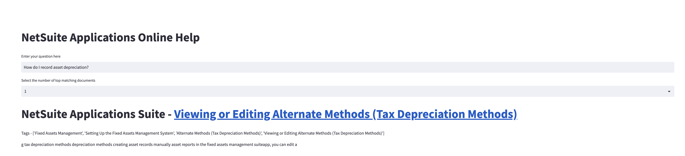

# Netsuite-QA
The NetSuite application suite contains extensive documentation to guide a user through each of their many enterprise applications. Although NetSuite Documentation may be rich with information, it is extremely difficult to find the exact information you need. This is where Netsuite-QA comes in. Netsuite-QA is a question and answer application that allows users to ask questions about NetSuite and receive answers directly from the NetSuite documentation. This application is built using the [ElasticDocumentStore](https://www.elastic.co/guide/en/elasticsearch/reference/current/documents-indices.html) with an Embedding Retriever.

## Installation

1. `pip install git+https://github.com/deepset-ai/haystack.git`
2. `pip install streamlit`
3. `pip install uvicorn`

## Dataset

- [NetSuite Documentation](https://docs.oracle.com/cloud/latest/netsuitecs_gs/NSCSUG/index.html)

- Extracted with `data_extraction.ipynb`

- Training Data: `data_with_text.csv`
    - Contains 17,936 unique HTML pages
- Test Data: `test_data_2.csv`
    - Contains 60 unique queries and their corresponding document names

## Model
- Model experimentation performed in `Netsuite_QA.ipynb`
- [Embedding Retriever](https://docs.haystack.deepset.ai/docs/retriever) selected for its ability to retrieve relevant documents from a large corpus of documents
    - Embedding Model: [sentence-transformers/all-MiniLM-L6-v2](https://huggingface.co/sentence-transformers/all-MiniLM-L6-v2)
- [FARMReader](https://docs.haystack.deepset.ai/docs/reader) selected for its ability to extract answers from a given document
    - Reader Model: [deepset/roberta-base-squad2](https://huggingface.co/deepset/roberta-base-squad2)

## Start ElasticSearch

To initialize ElasticDocumentStore Docker Container
- `uvicorn main:app`

This will
- Serialize NetSuite documentation as JSON documents
- Index the documents in ElasticSearch
- Initiallize EmbeddingRetriever 

## Inference

- Streamlit
    - `streamlit run app.py` is the main file for the Streamlit app
- Uvicorn

    - `uvicorn main_inference:app`

## Example Query

`How do I record asset depreciation?`

## References

[1] “Banking SuiteApps,” Oracle Help Center, 09-Jul-2021. [Online]. Available: https://docs.oracle.com/en/cloud/saas/netsuite/ns-online-help section_157913557426html. [Accessed: 24-Oct-2022].

[2] “Business software, business management software,” Netsuite.com. [Online]Available: https://www.netsuite.com/portal/home.shtml. [Accessed: 24-Oct-2022].

[3] “Beautifulsoup4,” PyPI. [Online]. Available: https://pypi.org/project/beautifulsoup4/. [Accessed: 24-Oct-2022].

[4] “Data in: documents and indices,” Elastic.co. [Online]. Available: https://www.elastic.co/guide/en/elasticsearch/reference/current/documents-indices.html. [Accessed: 24-Oct-2022].

[5] J. Devlin, M.-W. Chang, K. Lee, and K. Toutanova, “BERT: Pre-training of deep bidirectional Transformers for language understanding,” arXiv [cs.CL], 2018.

[6] L. Tunstall, L. von Werra, and T. Wolf, Natural language processing with transformers: Building language applications with hugging face. Sebastopol, CA: O’Reilly Media, 2022.

[7] “Streamlit • The fastest way to build and share data apps,” Streamlit.io. [Online]. Available: https://streamlit.io/. [Accessed: 05-Dec-2022].

[8] “Uvicorn,” Uvicorn.org. [Online]. Available: https://www.uvicorn.org/. [Accessed: 05-Dec-2022].

 

